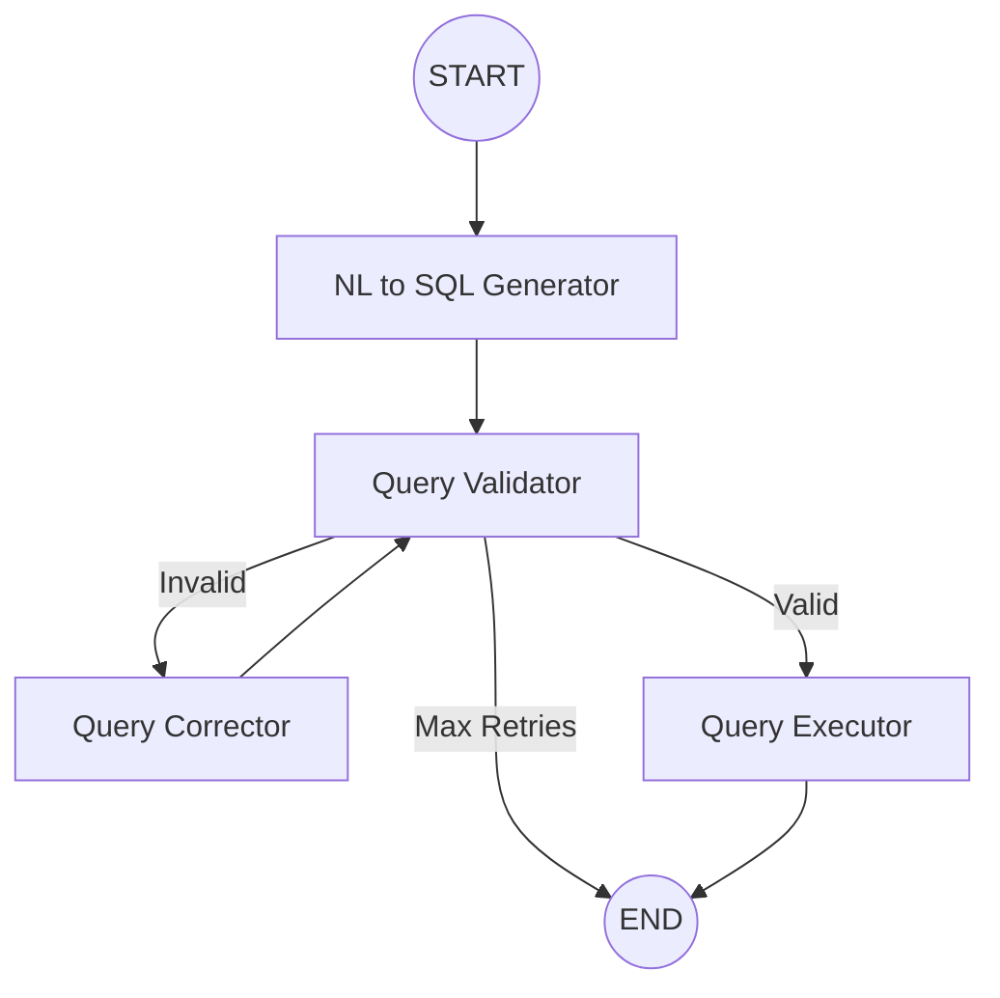

# LangGraph NL-to-SQL Pipeline for Logistics

A production-ready Natural Language to SQL conversion system specifically designed for Logistics and Transport Management Systems. Built with LangGraph, MySQL, and OpenAI.

## 🌟 Features

- **4-Node LangGraph Workflow**:
  1. **NL to SQL Generator**: Converts natural language to MySQL queries using domain-specific few-shot examples.
  2. **Query Validator**: Multi-point validation (syntax, schema, logic) using LLM.
  3. **Query Corrector**: Automatic iterative correction (up to 3 attempts) based on validation feedback.
  4. **Query Executor**: Secure execution via connection pooling and result formatting.

- **Production Grade Architecture**:
  - **Connection Pooling**: Efficient database resource management.
  - **Centralized Logging**: Consistent logging across all modules.
  - **Custom Exception Handling**: Granular error tracking and reporting.
  - **Pydantic Configuration**: Robust environment variable validation.
  - **Modular Package Structure**: Clean separation of concerns.

- **State Management**: 
  - Comprehensive state tracking using LangGraph's `TypedDict`.
  - Persistence support via Memory Checkpointers.

## 🏗️ Project Structure

```
src/nl_to_sql/
├── api/                # Application entry points (CLI, Flask, Slack)
│   ├── app.py          # Main application
│   ├── app_slack.py    # Slack-specific entry
│   └── app_sql.py      # Direct SQL interface
├── database/           # Database management and schema loaders
│   ├── database_manager.py     # MySQL connection pooling
│   └── mysql_schema_loader.py  # Schema extraction for LLM
├── pipeline/           # LangGraph workflow definition
│   └── nodes/          # Individual workflow nodes
├── utils/              # Shared utilities
│   ├── logger.py       # Centralized logging
│   └── exceptions.py   # Custom error types
├── config.py           # Pydantic configuration settings
└── langgraph_schema.py # Workflow state definition
tests/                  # Comprehensive test suite
```

## 🚀 Installation

1. **Clone the repository**

2. **Install dependencies**:
```bash
pip install -r requirements.txt
```

3. **Configure environment variables**:
   - Create a `.env` file in the root directory:
```env
OPENAI_API_KEY=your_openai_api_key
MYSQL_HOST=localhost
MYSQL_USER=root
MYSQL_PASSWORD=your_password
MYSQL_DATABASE=your_logistics_db
```

## 💻 Usage

### Interactive CLI Mode
```bash
PYTHONPATH=src python -m nl_to_sql.api.app
```

### Single Query Mode
```bash
PYTHONPATH=src python -m nl_to_sql.api.app -q "Top 5 billing parties by revenue in 2022"
```

### API/Slack Server Mode
```bash
PYTHONPATH=src python -m nl_to_sql.api.app --server
```

## 🧪 Testing

Run the test suite using pytest:
```bash
PYTHONPATH=src pytest tests/
```

## 📊 Workflow



## 📝 License

Internal Use / Educational.
