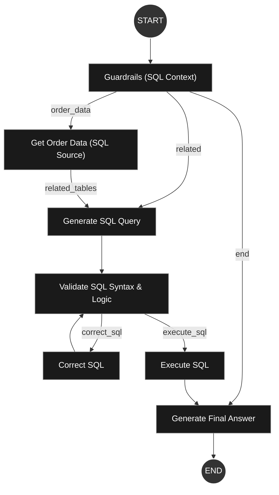
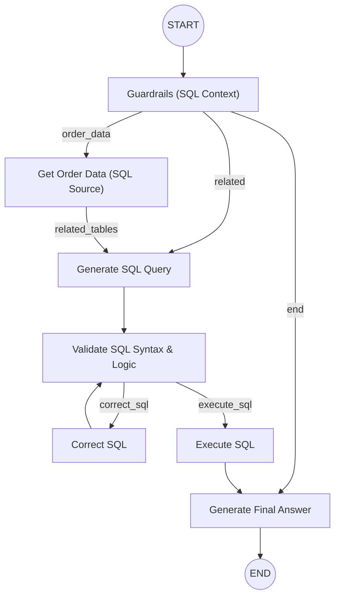

# SQL Pipeline Flow Documentation

This document describes the agentic workflow for the NL-to-SQL pipeline.

## Flowchart Visualization

```mermaid
graph TD
    START((START)) --> Guardrails["Guardrails (SQL Context)"]
    
    Guardrails -- "order_data" --> GetOrderData["Get Order Data (SQL Source)"]
    Guardrails -- "related" --> GenerateSQL["Generate SQL Query"]
    Guardrails -- "end" --> GenerateFinal["Generate Final Answer"]
    
    GetOrderData -- "related_tables" --> GenerateSQL
    
    GenerateSQL --> ValidateSQL["Validate SQL Syntax & Logic"]
    
    ValidateSQL -- "correct_sql" --> CorrectSQL["Correct SQL"]
    CorrectSQL --> ValidateSQL
    
    ValidateSQL -- "execute_sql" --> ExecuteSQL["Execute SQL"]
    
    ExecuteSQL --> GenerateFinal
    
    GenerateFinal --> END((END))

    style START fill:#333,stroke:#fff,stroke-width:2px,color:#fff
    style END fill:#333,stroke:#fff,stroke-width:2px,color:#fff
    style Guardrails fill:#1a1a1a,stroke:#888,color:#fff
    style GetOrderData fill:#1a1a1a,stroke:#888,color:#fff
    style GenerateSQL fill:#1a1a1a,stroke:#888,color:#fff
    style ValidateSQL fill:#1a1a1a,stroke:#888,color:#fff
    style CorrectSQL fill:#1a1a1a,stroke:#888,color:#fff
    style ExecuteSQL fill:#1a1a1a,stroke:#888,color:#fff
    style GenerateFinal fill:#1a1a1a,stroke:#888,color:#fff
```

## Mermaid Source Code

```mermaid
graph TD
    START((START)) --> Guardrails["Guardrails (SQL Context)"]
    
    Guardrails -- "order_data" --> GetOrderData["Get Order Data (SQL Source)"]
    Guardrails -- "related" --> GenerateSQL["Generate SQL Query"]
    Guardrails -- "end" --> GenerateFinal["Generate Final Answer"]
    
    GetOrderData -- "related_tables" --> GenerateSQL
    
    GenerateSQL --> ValidateSQL["Validate SQL Syntax & Logic"]
    
    ValidateSQL -- "correct_sql" --> CorrectSQL["Correct SQL"]
    CorrectSQL --> ValidateSQL
    
    ValidateSQL -- "execute_sql" --> ExecuteSQL["Execute SQL"]
    
    ExecuteSQL --> GenerateFinal
    
    GenerateFinal --> END((END))
```
